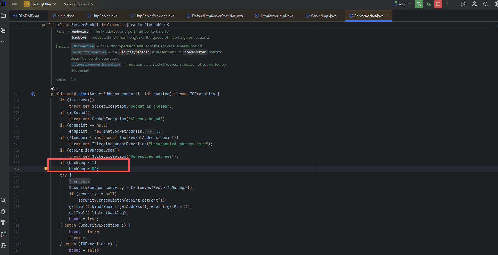
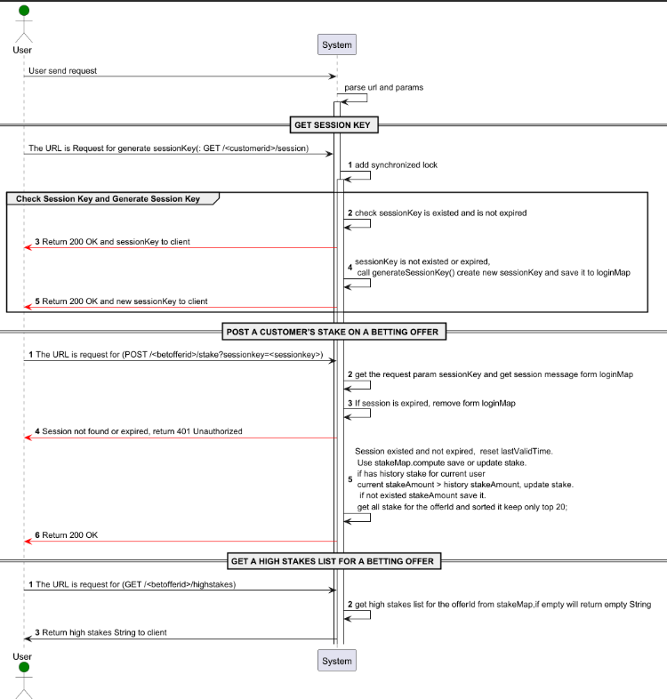

# There are two ways to provide an HttpServer
1. create() and create(InetSocketAddress addr, int backlog);  we choose the second method to create HttpServer. we can see from the picture,default backlog is 50, I search from the internet the linux default backlog is 128. so I set that to 100.
2. Because high-concurrent request,so we can't use default thread pool. it's cpu resource so set core and max is cpu of number    +1
# GET sessionKey
1. Because high-concurrent request and the session is stored in memory, so I use HashMap(loginMap) to store session and add lock(Synchronized).
2. Get user session from loginMap, and check the session is expired, if not expired then return session and reset login time.
3. if not exist session we create a new session and store it in loginMap.
4. Why I choose SecureRandom? Because I used to use it in my previous project, and it is secure and true random number generate.
# POST save or update betting offer stake for offerId
1. Get userInfo from HashMap(loginMap),  and check userInfo is existed and the session is expired and remove it.
2. Why I choose ConcurrentHashMap?
    2.1 Because high-concurrent request, so I choose ConcurrentHashMap to store stakes for betting offer and avoid concurrent problem.
    2.2 When I add stake or modify stake, I use compute method to avoid concurrent problem. No need to add lock.
3. When update or add stake finished, sort the stake list by stake amount and time and store keep top20  in ConcurrentHashMap(stakeMap).
# Sequence
